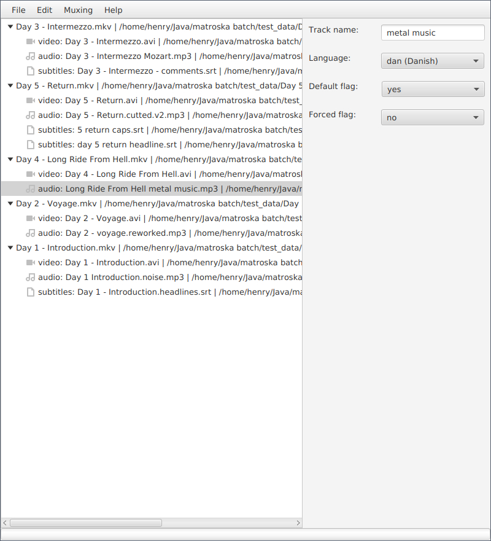
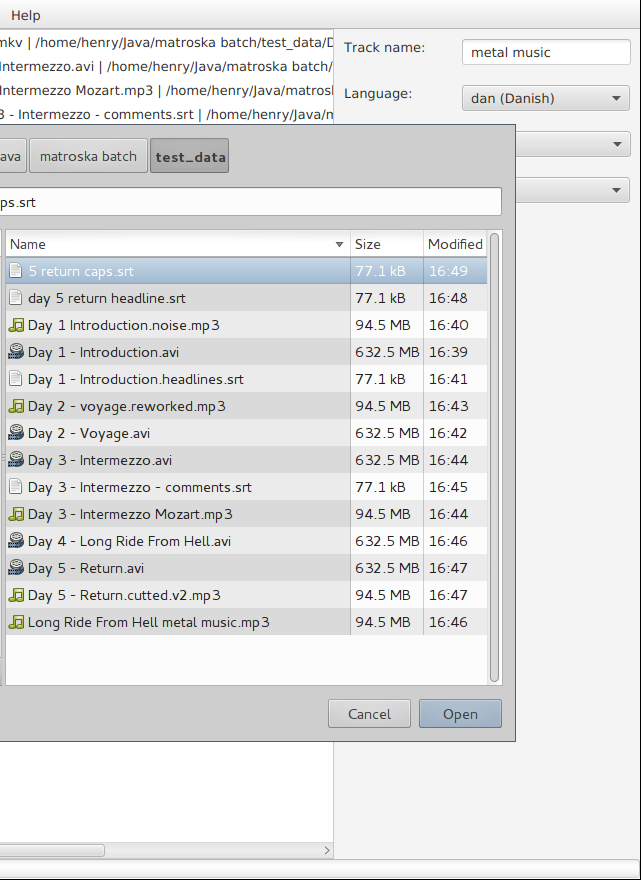

Matroska Batch
==============

MatroskaBatch is used for batch muxing of multimedia files to Matroska
container. If you not using
[mkvtoolnix](https://www.bunkus.org/videotools/mkvtoolnix/) (or specifically
`mkvmerge`), you probably don't need MatroskaBatch.

MatroskaBatch automagically organises files by their _names_ and mux them to
the closest video file. This smart matching provides the easiest way to add
audio or subtitles to existing Matroska files. It also handles well muxing
multiple non-Matroska files together (i.e. video, audio and subtitle track) as
long as they have similar names. Manual file-by-file mode is also available
for fine tuning.

MatroskaBatch Server provides API for remote muxing. It provides easy way of
muxing large media files on media servers etc.

Running desktop app
-------------------

MatroskaBatch is Java program. You need Java 8 (Oracle Java or OpenJDK) and
Java FX to run MatroskaBatch. On debian-based systems run

	sudo aptitude install openjdk-8-jre openjfx

MatroskaBatch uses `mkvmerge` for muxing so you need
[mkvtoolnix](https://www.bunkus.org/videotools/mkvtoolnix/) on your system. It
is packaged for most systems. On debian distros run

	sudo aptitude install mkvtoolnix

`mkvmerge` must be installed in `$PATH`, which is default if you used
package manager.

Now you are ready to run MatroskaBatch

	java -jar MatroskaBatch.jar

Building
--------

This project uses [gradle](http://gradle.org/) for building. Gradle wrapper is
not included, gradle needs to be installed on your machine.

There are 3 projects `desktop`, `server`, `common`.

To build & run desktop application use

	gradle run

To build server war archive use

	gradle war

Remote muxing
-------------

MatroskaBatch can work in remote mode. For remote muxing, you don't need
`mkvmerge` installed on client (only on server).

### Server

MatroskaBatch Server is servlet-based application providing REST
API. You need to use container server such as Tomcat or complete Java EE
platform such as Glassfish to run server part of MatroskaBatch.

`gradle war` will create a war archive with all dependencies. Install it
according to your platform documentation (e. g. copy to monitored folder).

Server can be configured through 2 context parameters. Default configuration:

	<context-param>
		<param-name>mediaRoot</param-name>
		<param-value>/</param-value>
	</context-param>
	<context-param>
		<param-name>rootURI</param-name>
		<param-value>matroskabatch</param-value>
	</context-param>

`mediaRoot` is folder that all paths will be resolved against (all URIs
representing files will be relative to this folder). `rootURI` will be used as
hostname in such file URIs.

Rest API will be available under /rest webapp path. Final URL then may look as
`http://localhost:8080/MatroskaBatchServer-1.0/rest` or similar
according your server config.

### Client

MatroskaBatch Java FX application can be used for remote muxing. Connect to
server in remote menu and start working remotely. All functionality is
available in remote mode.

Copyright
---------

Unless otherwise stated, this project is licensed under terms of MIT licence, see [LICENSE](LICENSE)
for details.

Currently [icons](src/main/resources/icons/), which are derived from GNOME
Icon Theme are licensed under
[CreativeCommons](src/main/resources/icons/LICENSE) licence. 
